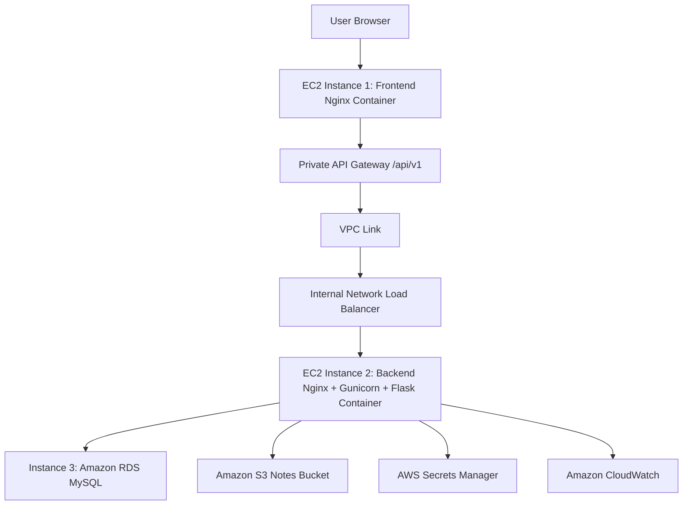

# AWS Cloud Notes Storage System

A production-style cloud-native notes storage system using a clean 3-layer architecture, containerized frontend and backend services, Private API Gateway, RDS MySQL metadata storage, S3 object storage, IAM roles, Secrets Manager, and CloudWatch logging.

## Architecture



## Why These Technologies

- API Gateway: central entry point for versioned APIs, throttling, access policies, logging, and private VPC integration.
- Docker: consistent runtime from VS Code to EC2, fewer deployment surprises, repeatable builds.
- Gunicorn: production WSGI server for Flask; Flask's built-in server is development-only.
- Nginx: serves the frontend efficiently and reverse-proxies to Gunicorn inside the backend container.
- IAM Roles: short-lived instance credentials without AWS access keys in code or GitHub.
- S3: durable, scalable object storage for uploaded files.
- RDS MySQL: managed relational database for metadata, backups, encryption, and operational reliability.
- Secrets Manager: database credentials are encrypted, audited, rotated, and retrieved securely at runtime.
- EC2: direct control for an interview-friendly deployment while still using AWS-managed services around it.
- CloudWatch: centralized logs, metrics, alarms, and operational visibility.
- 3-layer architecture: separates browser delivery, business/API logic, and persistent data so each layer can scale and be secured independently.

## Technology Stack

- Frontend: HTML, Bootstrap, JavaScript, Nginx, Docker.
- Backend: Python, Flask, Gunicorn, Nginx, PyMySQL, boto3, Docker.
- Data: Amazon RDS MySQL for metadata, Amazon S3 for files.
- AWS: EC2, API Gateway Private REST API, VPC Link, IAM, Secrets Manager, CloudWatch.

## Folder Structure

```text
aws-cloud-notes-storage-system/
  frontend/
    index.html
    Dockerfile
    nginx/default.conf
    static/js/config.js
    static/js/app.js
    static/css/styles.css
  backend/
    app.py
    Dockerfile
    supervisord.conf
    gunicorn/gunicorn.conf.py
    nginx/default.conf
    app/
      routes/
      controllers/
      services/
      repository/
      models/
      config/
      middleware/
      utils/
  database/schema.sql
  database/Dockerfile
  docs/aws/
  docker-compose.yml
  .env.example
```

## API Documentation

Base URL:

```text
https://xxxxxxxx.execute-api.region.amazonaws.com/api/v1
```

Endpoints:

| Method | Path | Purpose |
| --- | --- | --- |
| POST | `/files` | Upload a file with `title` and `file` form fields |
| GET | `/files?page=1&page_size=10` | List files with pagination |
| GET | `/files/{filename}` | Generate a short-lived S3 download URL |
| DELETE | `/files/{id}` | Delete file metadata and S3 object |
| GET | `/files/search?title=report` | Search files by title |

## Local Development

Copy the example environment file and fill in local values:

```bash
cp .env.example .env
```

Start all containers:

```bash
docker compose up --build
```

Run backend tests:

```bash
cd backend
pip install -r requirements-dev.txt
pytest
```

Open:

```text
http://localhost:8080
```

The frontend API base URL is configured through the `API_BASE_URL` environment variable in Docker. For AWS, set it to your API Gateway URL.

## Docker Commands

Build frontend:

```bash
docker build -t notes-frontend ./frontend
```

Run frontend:

```bash
docker run -d --name notes-frontend -p 80:80 notes-frontend
```

Run frontend with an API Gateway URL:

```bash
docker run -d --name notes-frontend -p 80:80 \
  -e API_BASE_URL=https://xxxxxxxx.execute-api.ap-south-1.amazonaws.com/api/v1 \
  notes-frontend
```

Build backend:

```bash
docker build -t notes-backend ./backend
```

Run backend:

```bash
docker run -d --name notes-backend -p 80:80 \
  -e AWS_REGION=ap-south-1 \
  -e S3_BUCKET_NAME=your-bucket \
  -e DB_SECRET_ID=prod/notes/db \
  -e DB_SSL=true \
  notes-backend
```

## AWS Deployment Summary

1. Create a VPC with public, private application, and private database subnets.
2. Launch EC2 Instance 1 in a public subnet for the frontend container.
3. Launch EC2 Instance 2 in a private application subnet for the backend container.
4. Create Amazon RDS MySQL in private database subnets with public access disabled.
5. Create an encrypted S3 bucket for uploaded files.
6. Store database connection values in Secrets Manager.
7. Attach an IAM role to the backend EC2 instance using `docs/aws/backend-ec2-instance-policy.json`.
8. Create an internal NLB for the backend EC2 instance.
9. Create API Gateway as a Private REST API and integrate it with the NLB through VPC Link.
10. Configure CloudWatch logs and alarms.

Full details are in `docs/aws/deployment-guide.md`.

## Security Notes

- No database passwords or AWS credentials are stored in `config.py`, `app.py`, Dockerfiles, or GitHub.
- EC2 uses IAM roles instead of static access keys.
- RDS traffic uses TLS when connecting to a non-localhost database.
- S3 uploads use server-side encryption.
- API Gateway is private and restricted by VPC endpoint policy.
- Backend EC2 is reachable only from the internal NLB.

## Screenshots Placeholder

Add screenshots here after deployment:

- Frontend upload page.
- File listing with pagination.
- API Gateway execution logs.
- CloudWatch dashboard.

## Future Improvements

- Add Cognito authentication and per-user ownership.
- Add virus scanning for uploaded files.
- Add CI/CD with GitHub Actions and ECR.
- Add Terraform or AWS CDK infrastructure as code.
- Add S3 lifecycle policies for retention management.
- Add RDS read replica support for heavier read workloads.
